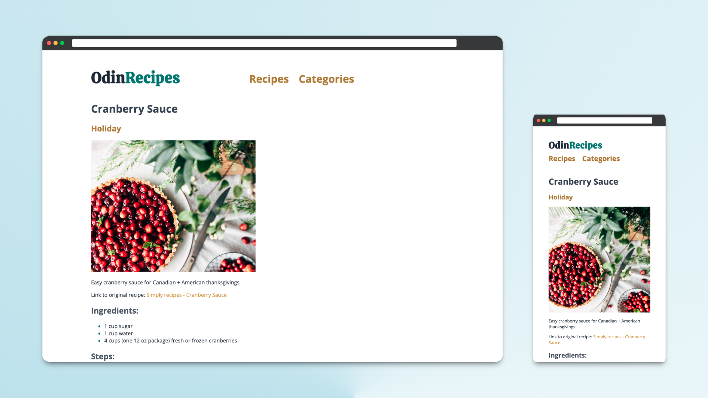
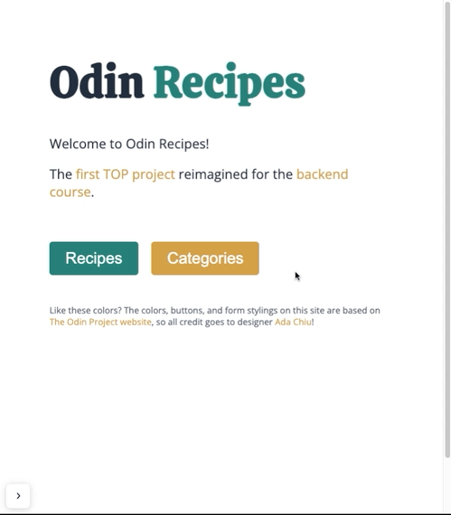

<h1 align="center">Odin Recipes</h1>

CRUD application built with Express.

## Description
I created this web app for The Odin Project [Inventory Application](https://www.theodinproject.com/lessons/nodejs-inventory-application) assignment. The task was to create a CRUD application with an Express backend and MongoDB database to manage an inventory of items and categories.

## Project Objectives
- All CRUD actions for both items and categories
- MongoDB database with mongoose for models
- Protect destructive actions (edit, delete) with an admin password
- Server-side form validation with express-validator
- Views in any Express.js templating engine
- Image upload with multer

## Usage
Visit the live site at [odin-recipes.onrender.com](https://odin-recipes.onrender.com/) to view the recipes and categories or add new ones.

Note: the free tier Render web service is sometimes *very* slow to spin up, but will be snappy once started.

## Features
- User-friendly forms with informative error messages, automatic list creation, and image preview
- Uploaded images initially served from the filesystem for a responsive authoring experience
- Images are then saved and served from Cloudinary for persistent storage on hosting platforms with ephemeral storage
- Mobile-responsive

## Demo

## Technologies used
- [Express](https://expressjs.com/)
- [MongoDB](https://www.mongodb.com/)
- [Mongoose](https://mongoosejs.com/) MongoDB ODM for Node.js
- [express-validator](https://express-validator.github.io/docs/) Express middleware for validation and sanitization
- [multer](https://github.com/expressjs/multer) Node.js middleware for handling `multipart/form-data`
- [Cloudinary Node SDK](https://github.com/cloudinary/cloudinary_npm) Cloudinary integration for Node.js
- [EJS (Embedded JavaScript)](https://ejs.co/) View templating engine
- [Render](https://render.com/) Cloud application hosting

